# InsightFlow: Product Analytics Platform

**End-to-End Product Analytics Platform with SQL Warehouse, Funnel Analysis & AI Insights**

---

## Document Control

| Field | Value |
|---|---|
| Document Title | InsightFlow — Software Design Document (SDD) & Software Requirements Specification (SRS) |
| Version | 1.0.0 |
| Status | Approved for Implementation |
| Classification | Internal Engineering Documentation |
| Owner | Product Analytics Engineering |
| Document Type | Combined SDD + SRS |
| Audience | Backend Engineers, Data Engineers, Analytics Engineers, Product Managers |
| Related Systems | PostgreSQL Warehouse, ETL Service, Analytics API, Streamlit Dashboard, AI Copilot |

### Revision History

| Version | Date | Author | Change Summary |
|---|---|---|---|
| 0.1.0 | Week 0 | Analytics Eng | Initial skeleton, scope, and goals |
| 0.5.0 | Week 2 | Analytics Eng | Warehouse schema and ETL design finalized |
| 0.9.0 | Week 5 | Analytics Eng | Analytics layer, dashboards, AI copilot design |
| 1.0.0 | Week 8 | Analytics Eng | Full document, ready for build |

---

## Table of Contents

1. Overview & Purpose
2. Scope, Assumptions & Glossary
3. Software Requirements Specification (SRS)
4. Phase 1 — Data Warehouse
5. Phase 2 — ETL Pipeline
6. Phase 3 — Advanced SQL Analytics Layer
7. Phase 4 — Product Analytics
8. Phase 5 — Dashboard
9. Phase 6 — AI Analytics Copilot
10. Website Workflow
11. Project Structure
12. Tech Stack
13. Project Architecture (Diagrams)
14. API Design
15. Security
16. Future Enhancements
17. Resume Section
18. Interview Preparation
19. Learning Outcomes
20. Development Roadmap
21. What Not To Build
22. Appendix

---

## 1. Overview & Purpose

InsightFlow is a product analytics platform that reproduces the internal analytics stack used by consumer-tech companies such as Porter, Swiggy, Meesho, Razorpay, Uber, Airbnb, Amazon, and PhonePe. Its purpose is not to render charts. Its purpose is to **answer business questions from raw behavioral event data** and to translate those answers into decisions.

Most analytics side-projects stop at a dashboard that shows *what* happened. InsightFlow is designed to explain *why* it happened and *what to do next*. To do that it treats the whole path from raw events to recommendation as one engineered pipeline:

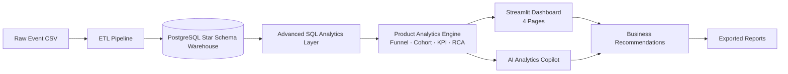

The platform answers, concretely:

- Why is revenue decreasing?
- Where are users dropping in the purchase funnel?
- Which city converts the best?
- Which device performs poorly?
- Which customer cohort retains the longest?
- Which products perform best?
- Which features improve retention?
- What actions should the business take?

The final artifact of any InsightFlow analysis is an **actionable recommendation**, not a metric.

### 1.1 Design Philosophy

Three principles drive every design decision in this document.

**Question-first, not chart-first.** Every view, table, and dashboard page exists to answer a named business question. If a component does not map to a question, it is cut.

**Warehouse as the single source of truth.** All analytics read from a governed star schema in PostgreSQL. No component queries raw CSVs directly. This guarantees that the dashboard, the API, and the AI copilot all agree on the numbers.

**Explainability over cleverness.** The AI copilot generates *SQL against the governed warehouse*, runs it, and summarizes real results. It does not hallucinate numbers. Every AI answer is traceable to a query and a row set.

---

## 2. Scope, Assumptions & Glossary

### 2.1 In Scope

- Batch ingestion of event-level eCommerce CSV data.
- A PostgreSQL star-schema warehouse with two fact tables and six dimensions.
- A Python ETL pipeline with cleaning, validation, surrogate-key generation, incremental loading, logging, and data-quality gates.
- An advanced SQL analytics layer of twelve views plus materialized views.
- A product analytics engine: funnel, cohort, KPI, and root-cause analysis.
- A four-page Streamlit dashboard.
- An AI copilot that converts business questions into SQL, executes it, and returns narrated recommendations.
- A REST API exposing every capability.

### 2.2 Out of Scope (see §21)

Real-time streaming, Kafka, Spark, Hadoop, Airflow, Kubernetes, Snowflake, and Azure Synapse are explicitly **not** built. Cron scheduling and single-node PostgreSQL are sufficient for the batch workload. These technologies appear only in Future Enhancements.

### 2.3 Assumptions

| # | Assumption |
|---|---|
| A1 | Source data arrives as event-level CSV files, one file per ingestion batch. |
| A2 | Event volume is in the millions-of-rows range — a workload a single PostgreSQL node handles comfortably. |
| A3 | Latency requirement is "fresh within the last scheduled run," not sub-second. |
| A4 | A single analyst-operator triggers or schedules ingestion; concurrent multi-tenant writes are not required. |
| A5 | LLM access is available via Gemini API or OpenAI API with a managed key. |

### 2.4 Glossary

| Term | Definition |
|---|---|
| Event | A single user action (e.g. `product_view`) with a timestamp and context. |
| Session | A bounded sequence of events by one user, identified by `session_id`. |
| Fact table | A table of measurable events/transactions at a defined grain. |
| Dimension | Descriptive context (who, what, where, when) joined to facts. |
| Surrogate key | A system-generated integer PK independent of business keys. |
| Grain | The level of detail one row of a fact table represents. |
| Funnel | An ordered set of steps users pass through toward a goal. |
| Cohort | A group of users bucketed by a shared start event (e.g. signup month). |
| SCD | Slowly Changing Dimension — how dimension history is tracked. |
| RCA | Root-Cause Analysis — decomposing a metric change into drivers. |

---

## 3. Software Requirements Specification (SRS)

### 3.1 Functional Requirements

| ID | Requirement | Priority |
|---|---|---|
| FR-01 | The system shall ingest event-level CSV files through an upload endpoint or a watched directory. | Must |
| FR-02 | The ETL shall clean, deduplicate, validate, and type-cast raw events before loading. | Must |
| FR-03 | The ETL shall generate surrogate keys and populate all dimensions and facts. | Must |
| FR-04 | The ETL shall support incremental loading keyed on a high-watermark timestamp. | Must |
| FR-05 | The ETL shall write structured logs and fail closed on data-quality violations. | Must |
| FR-06 | The warehouse shall implement a star schema with Fact_Events, Fact_Orders, and six dimensions. | Must |
| FR-07 | The analytics layer shall expose twelve named SQL views and materialized equivalents for heavy views. | Must |
| FR-08 | The system shall compute funnel conversion and drop-off by device, city, and category. | Must |
| FR-09 | The system shall compute monthly and weekly retention cohorts and a retention heatmap. | Must |
| FR-10 | The system shall compute the full KPI set (revenue, DAU/WAU/MAU, AOV, CLV, CAC, etc.). | Must |
| FR-11 | The system shall perform root-cause analysis that decomposes a metric change into drivers. | Must |
| FR-12 | The dashboard shall present exactly four pages: Executive, Funnel, Customer, Product. | Must |
| FR-13 | The AI copilot shall translate a natural-language business question into warehouse SQL, execute it, and return a narrated recommendation. | Must |
| FR-14 | The system shall export reports (PDF/CSV) of any dashboard page or AI answer. | Should |
| FR-15 | The REST API shall expose upload, etl, dashboard, funnel, cohort, kpi, root-cause, ai, and reports endpoints. | Must |

### 3.2 Non-Functional Requirements

| ID | Category | Requirement |
|---|---|---|
| NFR-01 | Performance | A full analytics view refresh over a batch shall complete within the scheduled window (target < 10 min for millions of rows). |
| NFR-02 | Reliability | ETL runs shall be idempotent; re-running a batch shall not create duplicates. |
| NFR-03 | Data Quality | A batch failing any hard quality gate shall be rejected and quarantined, not partially loaded. |
| NFR-04 | Security | All secrets shall be injected via environment variables; no credentials in source. |
| NFR-05 | Observability | Every ETL run shall emit a run record with row counts, duration, and status. |
| NFR-06 | Maintainability | SQL logic shall live in versioned `.sql` files, not embedded strings. |
| NFR-07 | Portability | The stack shall run on a single machine with PostgreSQL and Python 3.11+. |
| NFR-08 | Explainability | Every AI answer shall include the generated SQL and the numeric result it summarized. |

### 3.3 Actors

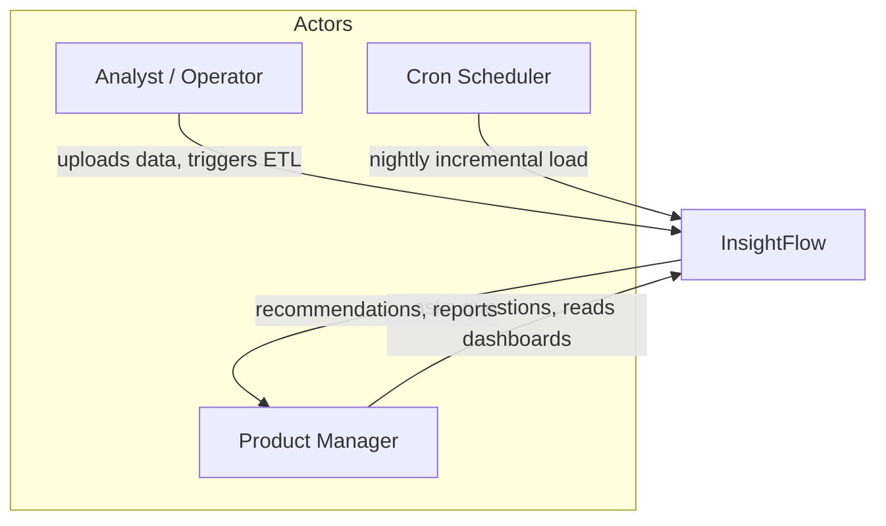

---

## 4. Phase 1 — Data Warehouse

### 4.1 Modeling Approach: Why Star, Not Snowflake

InsightFlow uses a **star schema**: two central fact tables surrounded by denormalized dimensions.

A snowflake schema would further normalize dimensions (e.g. splitting `Dim_Location` into `city → state → country` tables). We deliberately reject that for this workload:

| Consideration | Star (chosen) | Snowflake (rejected) |
|---|---|---|
| Join count for a typical funnel query | 1 hop per dimension | 2–4 hops per dimension |
| Query readability for analysts | High — flat dimensions | Lower — chains of joins |
| Read performance | Faster, fewer joins | Slower on wide analytical scans |
| Storage | Slightly higher (redundancy) | Lower |
| Write/update complexity | Simple | Higher referential overhead |
| Fit for BI tools (Power BI/Streamlit) | Native fit | Requires extra modeling |

Analytics workloads are **read-heavy, join-heavy, and scan-wide**. The star schema trades a little storage redundancy for far simpler and faster reads, which is exactly the right trade for a product-analytics warehouse. Dimension tables here are small (cities, devices, channels number in the hundreds or thousands), so the storage cost of denormalization is negligible.

### 4.2 Schema Overview

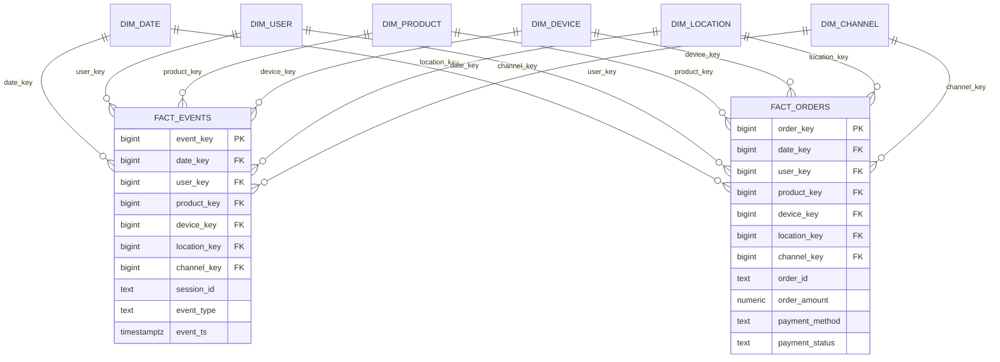

### 4.3 Table Reference

The raw event record supplies these fields: `session_id, user_id, timestamp, event_type` (one of `page_view, search, product_view, add_to_cart, checkout, payment, purchase`), `device, city, browser, product_id, country, traffic_source, campaign`. The warehouse decomposes these into facts and dimensions below.

---

#### 4.3.1 Dim_Date

- **Purpose:** A conformed calendar dimension enabling time-based grouping (day, week, month, quarter, weekday/weekend) without repeatedly parsing timestamps at query time.
- **Grain:** One row per calendar day.

| Column | Type | Notes |
|---|---|---|
| date_key | BIGINT | Surrogate PK, format `YYYYMMDD` (e.g. `20260714`) |
| full_date | DATE | Actual date |
| day | SMALLINT | Day of month (1–31) |
| month | SMALLINT | Month number (1–12) |
| month_name | TEXT | e.g. "July" |
| quarter | SMALLINT | 1–4 |
| year | SMALLINT | e.g. 2026 |
| week_of_year | SMALLINT | ISO week |
| day_of_week | SMALLINT | 1=Mon … 7=Sun |
| is_weekend | BOOLEAN | TRUE for Sat/Sun |

- **Primary Key:** `date_key`
- **Foreign Keys:** none (root dimension)
- **Relationships:** 1-to-many into `Fact_Events` and `Fact_Orders`.
- **Indexes:** PK on `date_key`; secondary btree on `full_date`.
- **Sample Records:**

| date_key | full_date | month_name | quarter | day_of_week | is_weekend |
|---|---|---|---|---|---|
| 20260713 | 2026-07-13 | July | 3 | 1 | false |
| 20260714 | 2026-07-14 | July | 3 | 2 | false |
| 20260719 | 2026-07-19 | July | 3 | 7 | true |

---

#### 4.3.2 Dim_User

- **Purpose:** Describes each user and their acquisition context; anchors cohort and retention analysis.
- **Grain:** One row per user (SCD Type 2 optional for acquisition attributes).

| Column | Type | Notes |
|---|---|---|
| user_key | BIGINT | Surrogate PK |
| user_id | TEXT | Business/natural key from source |
| first_seen_date_key | BIGINT | FK → Dim_Date (acquisition day; cohort anchor) |
| acquisition_channel | TEXT | First-touch channel |
| user_type | TEXT | `new` / `returning` (derived) |
| lifetime_orders | INT | Maintained by ETL |
| lifetime_revenue | NUMERIC | Maintained by ETL |

- **Primary Key:** `user_key`
- **Foreign Keys:** `first_seen_date_key → Dim_Date.date_key`
- **Relationships:** 1-to-many into both facts.
- **Indexes:** PK on `user_key`; unique btree on `user_id`; btree on `first_seen_date_key`.
- **Sample Records:**

| user_key | user_id | first_seen_date_key | acquisition_channel | user_type |
|---|---|---|---|---|
| 1001 | u_88213 | 20260601 | google_organic | returning |
| 1002 | u_91277 | 20260713 | meta_ads | new |

---

#### 4.3.3 Dim_Product

- **Purpose:** Describes products and their categories for product-performance and category analysis.
- **Grain:** One row per product.

| Column | Type | Notes |
|---|---|---|
| product_key | BIGINT | Surrogate PK |
| product_id | TEXT | Business key |
| product_name | TEXT | Display name |
| category | TEXT | e.g. Electronics, Fashion |
| sub_category | TEXT | e.g. Mobiles |
| unit_price | NUMERIC | List price |

- **Primary Key:** `product_key`
- **Foreign Keys:** none
- **Relationships:** 1-to-many into both facts.
- **Indexes:** PK on `product_key`; unique on `product_id`; btree on `category`.
- **Sample Records:**

| product_key | product_id | product_name | category | unit_price |
|---|---|---|---|---|
| 5001 | p_1001 | Wireless Earbuds | Electronics | 1999.00 |
| 5002 | p_2044 | Cotton T-Shirt | Fashion | 599.00 |

---

#### 4.3.4 Dim_Device

- **Purpose:** Describes the device and browser used, enabling device-performance comparison (a key RCA lever).
- **Grain:** One row per unique device+browser combination.

| Column | Type | Notes |
|---|---|---|
| device_key | BIGINT | Surrogate PK |
| device | TEXT | `Android` / `iOS` / `Desktop` |
| browser | TEXT | `Chrome` / `Safari` / etc. |
| os_family | TEXT | Derived |
| is_mobile | BOOLEAN | Derived |

- **Primary Key:** `device_key`
- **Foreign Keys:** none
- **Relationships:** 1-to-many into both facts.
- **Indexes:** PK on `device_key`; composite unique on `(device, browser)`.
- **Sample Records:**

| device_key | device | browser | is_mobile |
|---|---|---|---|
| 3001 | Android | Chrome | true |
| 3002 | Desktop | Chrome | false |

---

#### 4.3.5 Dim_Location

- **Purpose:** Geographic context for city/country conversion analysis.
- **Grain:** One row per city (with its country).

| Column | Type | Notes |
|---|---|---|
| location_key | BIGINT | Surrogate PK |
| city | TEXT | e.g. Bangalore |
| country | TEXT | e.g. India |
| region | TEXT | Derived (South, North …) |
| tier | TEXT | City tier (1/2/3) |

- **Primary Key:** `location_key`
- **Foreign Keys:** none
- **Relationships:** 1-to-many into both facts.
- **Indexes:** PK on `location_key`; composite unique on `(city, country)`.
- **Sample Records:**

| location_key | city | country | tier |
|---|---|---|---|
| 4001 | Bangalore | India | 1 |
| 4002 | Indore | India | 2 |

---

#### 4.3.6 Dim_Channel

- **Purpose:** Marketing attribution — traffic source and campaign — for acquisition and marketing ROI questions.
- **Grain:** One row per traffic_source + campaign combination.

| Column | Type | Notes |
|---|---|---|
| channel_key | BIGINT | Surrogate PK |
| traffic_source | TEXT | e.g. google, meta, direct |
| campaign | TEXT | Campaign name/id |
| channel_group | TEXT | Paid / Organic / Direct (derived) |

- **Primary Key:** `channel_key`
- **Foreign Keys:** none
- **Relationships:** 1-to-many into both facts.
- **Indexes:** PK on `channel_key`; composite unique on `(traffic_source, campaign)`.
- **Sample Records:**

| channel_key | traffic_source | campaign | channel_group |
|---|---|---|---|
| 6001 | google | brand_search | Paid |
| 6002 | direct | (none) | Direct |

---

#### 4.3.7 Fact_Events

- **Purpose:** The behavioral spine of the warehouse. One row per user event, enabling funnel and engagement analysis.
- **Grain:** One row per event.

| Column | Type | Notes |
|---|---|---|
| event_key | BIGINT | Surrogate PK |
| date_key | BIGINT | FK → Dim_Date |
| user_key | BIGINT | FK → Dim_User |
| product_key | BIGINT | FK → Dim_Product (nullable for non-product events) |
| device_key | BIGINT | FK → Dim_Device |
| location_key | BIGINT | FK → Dim_Location |
| channel_key | BIGINT | FK → Dim_Channel |
| session_id | TEXT | Session grouping |
| event_type | TEXT | page_view … purchase |
| event_ts | TIMESTAMPTZ | Exact event time |

- **Primary Key:** `event_key`
- **Foreign Keys:** all six `*_key` columns to their dimensions.
- **Relationships:** many-to-1 to each dimension.
- **Indexes:** PK on `event_key`; btree on `date_key`; btree on `(session_id)`; btree on `(user_key, event_ts)`; btree on `event_type`. Range **partitioning by `date_key`** (monthly).
- **Sample Records:**

| event_key | date_key | user_key | event_type | session_id | event_ts |
|---|---|---|---|---|---|
| 900001 | 20260714 | 1002 | product_view | s_5521 | 2026-07-14 10:02:11+05:30 |
| 900002 | 20260714 | 1002 | add_to_cart | s_5521 | 2026-07-14 10:03:44+05:30 |

---

#### 4.3.8 Fact_Orders

- **Purpose:** Monetary spine. One row per order line, enabling revenue, AOV, payment-success, and CLV analysis.
- **Grain:** One row per completed/attempted order line.

| Column | Type | Notes |
|---|---|---|
| order_key | BIGINT | Surrogate PK |
| date_key | BIGINT | FK → Dim_Date |
| user_key | BIGINT | FK → Dim_User |
| product_key | BIGINT | FK → Dim_Product |
| device_key | BIGINT | FK → Dim_Device |
| location_key | BIGINT | FK → Dim_Location |
| channel_key | BIGINT | FK → Dim_Channel |
| order_id | TEXT | Business key |
| order_amount | NUMERIC | Line revenue |
| quantity | INT | Units |
| payment_method | TEXT | UPI / Card / COD / Wallet |
| payment_status | TEXT | success / failed / pending |

- **Primary Key:** `order_key`
- **Foreign Keys:** all six `*_key` columns.
- **Relationships:** many-to-1 to each dimension.
- **Indexes:** PK on `order_key`; btree on `date_key`; btree on `(user_key)`; btree on `payment_status`; btree on `payment_method`. Range **partitioning by `date_key`** (monthly).
- **Sample Records:**

| order_key | date_key | user_key | order_amount | payment_method | payment_status |
|---|---|---|---|---|---|
| 700001 | 20260714 | 1001 | 1999.00 | UPI | success |
| 700002 | 20260714 | 1002 | 599.00 | UPI | failed |

### 4.4 Warehouse Design Decisions

1. **Surrogate integer keys everywhere.** Business keys (`user_id`, `product_id`) are strings and may change or be reused; integer surrogate keys keep joins fast and insulate facts from source changes.
2. **Two facts, one conformed dimension set.** `Fact_Events` (behavior) and `Fact_Orders` (money) share the same six dimensions ("conformed dimensions"), so a filter like *Bangalore + Android* means the same thing in both — essential for RCA that spans behavior and revenue.
3. **Partition facts by `date_key`.** Analytics is almost always time-bounded; monthly range partitions let PostgreSQL prune irrelevant partitions and keep index sizes manageable.
4. **Nullable `product_key` on events.** Non-product events (`page_view`, `search`) carry no product; a null FK is cleaner than a synthetic "unknown product" for behavior.
5. **Dimensions stay denormalized (star).** Justified in §4.1.
6. **Nullable measures over sentinel rows.** Where a fact lacks a measure, we prefer `NULL` with `COALESCE` at read time over magic sentinel values, which keeps aggregates honest.

**Capacity & query-pattern rationale.** The dominant query shape is a time-bounded scan of one fact table joined to two or three small dimensions, grouped by a dimension attribute — for example, "successful revenue by city for the last 30 days." Monthly `date_key` range partitioning means such a query touches at most one or two partitions, and the composite indexes on `(user_key, event_ts)` and single-column indexes on `payment_status`/`payment_method`/`event_type` cover the common filters. Because dimensions are small (cities, devices, and channels number in the hundreds to low thousands), PostgreSQL keeps them in cache and hash-joins them to the fact scan cheaply. This is precisely why a single well-indexed, partitioned Postgres node comfortably serves the millions-of-rows workload without distributed compute — the read pattern is predictable, time-local, and join-shallow. When volume eventually outgrows a single node, the migration path is a managed cloud warehouse (§16), not a redesign, because the star model ports directly.

---

## 5. Phase 2 — ETL Pipeline

### 5.1 Architecture

The ETL is a modular Python service. Each stage is a testable function; the orchestrator wires them together and enforces data-quality gates between stages.

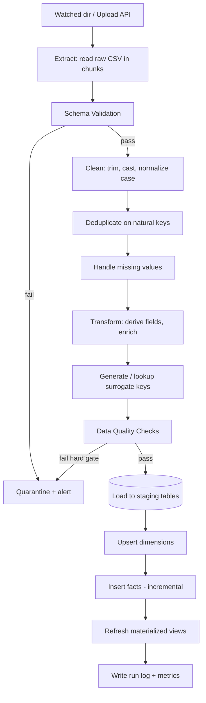

### 5.2 Stage Detail

**Extract.** Raw CSVs are read with pandas in chunks (`chunksize`) so memory stays bounded on large files. The extractor records source filename, row count, and file hash (for idempotency).

**Schema Validation.** Before any transformation, the incoming columns and dtypes are checked against an expected schema contract (column names, required non-null columns, allowed `event_type` values). A structural mismatch fails the batch immediately — this prevents a malformed file from silently poisoning the warehouse.

**Cleaning.** Whitespace trimmed; casing normalized (`Bangalore`/`bangalore` → canonical); timestamps parsed to timezone-aware `TIMESTAMPTZ`; numeric fields coerced with errors flagged.

**Duplicate Removal.** Events are deduplicated on the natural composite key `(user_id, session_id, event_type, timestamp)`. Orders dedupe on `order_id`. The file hash also guards against re-ingesting the same file (idempotency, NFR-02).

**Handling Missing Values.**

| Field | Strategy |
|---|---|
| `product_id` on non-product events | Left null (expected) |
| `city` / `country` | Impute `Unknown` and flag; row still loads |
| `timestamp` | If unparseable → row rejected to quarantine |
| `campaign` | Default to `(none)` |
| `order_amount` on a purchase | If null → hard failure (money integrity) |

**Transform / Enrich.** Derives `is_weekend`, `channel_group`, `is_mobile`, `user_type`, and splits/normalizes device+browser. Builds the natural-to-surrogate key maps.

**Surrogate Key Generation.** Dimensions are upserted first; the ETL then joins staged facts to dimensions to attach surrogate keys. New dimension members get new keys (monotonic sequences); existing members reuse keys.

**Load.** Cleaned data lands in staging tables, then dimensions are upserted (`INSERT ... ON CONFLICT DO UPDATE`), then facts are inserted incrementally.

**Incremental Loading.** A watermark table stores the max `event_ts` / `order` timestamp successfully loaded. Each run loads only rows newer than the watermark, then advances it inside the same transaction. This makes nightly Cron runs cheap and idempotent.

**Data Quality Checks (gates).**

| Gate | Rule | On failure |
|---|---|---|
| Null keys | No fact row may have null date/user/device/location/channel keys | Hard fail |
| Referential | Every fact FK must resolve to a dimension | Hard fail |
| Funnel monotonic sanity | `purchase` count ≤ `checkout` count ≤ `add_to_cart` count | Warn |
| Revenue integrity | `payment_status='success'` orders must have positive amount | Hard fail |
| Volume anomaly | Batch row count within Nσ of trailing average | Warn |

**Logging & Error Handling.** Python `logging` writes structured (JSON) logs to `logs/etl_YYYYMMDD.log`. Every run writes a row to an `etl_run_log` table: `run_id, source_file, rows_in, rows_loaded, rows_quarantined, status, started_at, finished_at`. Exceptions are caught per stage; a hard-gate failure raises and rolls back the transaction, leaving the warehouse untouched.

**Scheduling.** A Cron entry triggers the incremental run nightly (e.g. `0 2 * * *`). Cron is sufficient for a batch workload; Airflow is a future enhancement (§21).

### 5.3 Observability, Monitoring & Recovery

Every run is observable through the `etl_run_log` table and structured JSON logs. A run record captures `run_id`, `source_file`, `file_hash`, `rows_in`, `rows_loaded`, `rows_quarantined`, `status`, `started_at`, `finished_at`, and `error_message`. This makes it trivial to answer operational questions such as "which batch introduced the volume anomaly?" or "how long is the nightly load taking over the last 30 runs?"

**Quarantine.** Rows that fail row-level rules (unparseable timestamp, null money on a purchase) are written to a `quarantine_events` table with the failing rule name attached, rather than silently dropped. An analyst can inspect, correct, and re-submit them. Batch-level hard-gate failures roll back the entire transaction so the warehouse is never left in a partial state (NFR-02, NFR-03).

**Recovery.** Because loads are idempotent (file-hash guard + watermark), recovery from a failed run is simply "fix the input and re-run." No manual cleanup of half-loaded data is required. A full reload mode (`--mode full`) truncates staging and replays from `data/raw`, used only for schema migrations or backfills.

**Alerting.** Soft-gate warnings (volume anomaly, non-monotonic funnel counts) are logged and, when a threshold is breached, written to an alerts table that the Executive dashboard surfaces. Hard-gate failures additionally emit a non-zero exit code so Cron/monitoring flags the job.

| Signal | Source | Consumer |
|---|---|---|
| Run duration | `etl_run_log` | Ops trend chart |
| Rows quarantined | `quarantine_events` | Data-quality review |
| Volume anomaly | soft gate | Dashboard alert strip |
| Hard-gate failure | exit code | Cron / on-call |

### 5.4 Reference ETL Skeleton

```python
# etl/pipeline.py
import hashlib, logging, pandas as pd
from etl import extract, validate, clean, transform, keys, load, quality, watermark

log = logging.getLogger("insightflow.etl")

def run(source_path: str) -> dict:
    run_id = keys.new_run_id()
    file_hash = hashlib.sha256(open(source_path, "rb").read()).hexdigest()
    if load.already_ingested(file_hash):
        log.info("Skipping already-ingested file %s", source_path)
        return {"run_id": run_id, "status": "skipped"}

    frames, rows_in = [], 0
    for chunk in extract.read_csv_chunks(source_path):
        validate.schema(chunk)                 # hard gate
        chunk = clean.normalize(chunk)
        chunk = clean.dedupe(chunk)
        chunk = clean.handle_missing(chunk)
        chunk = transform.enrich(chunk)
        frames.append(chunk); rows_in += len(chunk)

    df = pd.concat(frames, ignore_index=True)
    df = df[df["event_ts"] > watermark.get()]  # incremental

    dims = keys.upsert_dimensions(df)
    facts = keys.attach_surrogate_keys(df, dims)
    quality.assert_gates(facts)                # hard gates

    with load.transaction() as tx:
        load.upsert_dims(tx, dims)
        loaded = load.insert_facts(tx, facts)
        watermark.advance(tx, facts["event_ts"].max())
        load.mark_ingested(tx, file_hash)

    load.refresh_materialized_views()
    load.write_run_log(run_id, source_path, rows_in, loaded)
    return {"run_id": run_id, "status": "success", "rows_loaded": loaded}
```

---

## 6. Phase 3 — Advanced SQL Analytics Layer

The analytics layer is a set of versioned SQL views over the warehouse. Views keep business logic in one governed place so the dashboard, API, and AI copilot compute metrics identically. Heavy aggregations are also materialized and refreshed at the end of each ETL run.

### 6.1 View Catalog

| View | Answers | Notes |
|---|---|---|
| `daily_kpis` | What happened each day? | Revenue, orders, DAU, conversion per day |
| `weekly_kpis` | Weekly trends | Rolls daily up to ISO week |
| `conversion_metrics` | How well do sessions convert? | Session→purchase rates |
| `retention_metrics` | Do users come back? | Cohort retention by period offset |
| `product_performance` | Which products win/lose? | Revenue, units, view→buy rate |
| `customer_growth` | Are we acquiring users? | New vs returning over time |
| `cart_abandonment` | Where is money lost pre-payment? | add_to_cart without purchase |
| `revenue_trend` | Revenue direction & momentum | With moving averages |
| `top_categories` | Best categories | Ranked by revenue |
| `payment_success` | Are payments healthy? | Success rate by method |
| `device_performance` | Which device underperforms? | Conversion + payment by device |
| `city_performance` | Which city converts best? | Conversion + revenue by city |

### 6.2 Selected View Definitions

`revenue_trend` — demonstrates window functions, moving average, and rolling windows:

```sql
CREATE OR REPLACE VIEW revenue_trend AS
WITH daily AS (
    SELECT d.full_date,
           SUM(o.order_amount) FILTER (WHERE o.payment_status = 'success') AS revenue
    FROM fact_orders o
    JOIN dim_date d ON d.date_key = o.date_key
    GROUP BY d.full_date
)
SELECT full_date,
       revenue,
       AVG(revenue) OVER (ORDER BY full_date
             ROWS BETWEEN 6 PRECEDING AND CURRENT ROW)  AS revenue_7d_moving_avg,
       SUM(revenue) OVER (ORDER BY full_date
             ROWS BETWEEN 29 PRECEDING AND CURRENT ROW) AS revenue_30d_rolling,
       LAG(revenue)  OVER (ORDER BY full_date)          AS prev_day_revenue,
       revenue - LAG(revenue) OVER (ORDER BY full_date) AS day_over_day_delta,
       CASE WHEN LAG(revenue) OVER (ORDER BY full_date) IS NULL THEN NULL
            ELSE ROUND(100.0 * (revenue - LAG(revenue) OVER (ORDER BY full_date))
                       / NULLIF(LAG(revenue) OVER (ORDER BY full_date),0), 2)
       END AS dod_growth_pct
FROM daily;
```

`product_performance` — demonstrates `RANK`, `DENSE_RANK`, `COALESCE`, and view→buy funnel per product:

```sql
CREATE OR REPLACE VIEW product_performance AS
WITH views AS (
    SELECT product_key, COUNT(*) AS view_cnt
    FROM fact_events WHERE event_type = 'product_view'
    GROUP BY product_key
),
buys AS (
    SELECT product_key,
           COUNT(*) AS order_cnt,
           SUM(order_amount) FILTER (WHERE payment_status='success') AS revenue
    FROM fact_orders GROUP BY product_key
)
SELECT p.product_key, p.product_name, p.category,
       COALESCE(v.view_cnt,0)  AS product_views,
       COALESCE(b.order_cnt,0) AS orders,
       COALESCE(b.revenue,0)   AS revenue,
       ROUND(100.0 * COALESCE(b.order_cnt,0)
             / NULLIF(v.view_cnt,0), 2) AS view_to_buy_pct,
       RANK()       OVER (ORDER BY COALESCE(b.revenue,0) DESC) AS revenue_rank,
       DENSE_RANK() OVER (PARTITION BY p.category
                          ORDER BY COALESCE(b.revenue,0) DESC) AS category_revenue_rank
FROM dim_product p
LEFT JOIN views v ON v.product_key = p.product_key
LEFT JOIN buys  b ON b.product_key = p.product_key;
```

`retention_metrics` — demonstrates cohort math with `ROW_NUMBER` and date offsets:

```sql
CREATE OR REPLACE VIEW retention_metrics AS
WITH first_month AS (
    SELECT u.user_key,
           DATE_TRUNC('month', d.full_date) AS cohort_month
    FROM dim_user u JOIN dim_date d ON d.date_key = u.first_seen_date_key
),
activity AS (
    SELECT DISTINCT o.user_key,
           DATE_TRUNC('month', d.full_date) AS active_month
    FROM fact_orders o JOIN dim_date d ON d.date_key = o.date_key
    WHERE o.payment_status = 'success'
)
SELECT fm.cohort_month,
       (EXTRACT(YEAR FROM a.active_month)*12 + EXTRACT(MONTH FROM a.active_month))
     - (EXTRACT(YEAR FROM fm.cohort_month)*12 + EXTRACT(MONTH FROM fm.cohort_month))
       AS month_offset,
       COUNT(DISTINCT a.user_key) AS active_users
FROM first_month fm
JOIN activity a ON a.user_key = fm.user_key
GROUP BY 1, 2;
```

`daily_kpis` — the workhorse materialized view most pages read from:

```sql
CREATE MATERIALIZED VIEW daily_kpis AS
WITH sessions AS (
    SELECT d.full_date, COUNT(DISTINCT session_id) AS sessions,
           COUNT(DISTINCT user_key) AS dau
    FROM fact_events f JOIN dim_date d ON d.date_key = f.date_key
    GROUP BY d.full_date
),
purchases AS (
    SELECT d.full_date,
           COUNT(*) FILTER (WHERE o.payment_status='success')            AS orders,
           SUM(o.order_amount) FILTER (WHERE o.payment_status='success') AS revenue,
           COUNT(DISTINCT o.user_key) FILTER (WHERE o.payment_status='success') AS buyers
    FROM fact_orders o JOIN dim_date d ON d.date_key = o.date_key
    GROUP BY d.full_date
)
SELECT s.full_date, s.sessions, s.dau,
       COALESCE(p.orders,0)  AS orders,
       COALESCE(p.revenue,0) AS revenue,
       ROUND(COALESCE(p.revenue,0)/NULLIF(p.orders,0),2)   AS aov,
       ROUND(100.0*COALESCE(p.orders,0)/NULLIF(s.sessions,0),2) AS conversion_pct
FROM sessions s LEFT JOIN purchases p ON p.full_date = s.full_date;
```

`payment_success` — payment health by method, a primary RCA lever:

```sql
CREATE OR REPLACE VIEW payment_success AS
SELECT payment_method,
       COUNT(*)                                              AS attempts,
       COUNT(*) FILTER (WHERE payment_status='success')      AS successes,
       ROUND(100.0 * COUNT(*) FILTER (WHERE payment_status='success')
             / NULLIF(COUNT(*),0), 2)                        AS success_rate_pct
FROM fact_orders
GROUP BY payment_method
ORDER BY success_rate_pct;
```

`device_performance` and `city_performance` follow the same shape — join `fact_orders`/`fact_events` to `dim_device`/`dim_location`, compute sessions, orders, conversion, and payment success per member, and rank them. `conversion_metrics` computes session→purchase rates overall and by segment; `cart_abandonment` counts carts (`add_to_cart` sessions) that never reach `purchase` and divides by all carts; `customer_growth` counts `new` vs `returning` users per period from `Dim_User.user_type`; `top_categories` ranks categories by successful revenue with `RANK`; `weekly_kpis` rolls `daily_kpis` up to ISO week with `DATE_TRUNC('week', full_date)`.

### 6.3 SQL Technique Demonstrations

| Technique | Where used | Purpose |
|---|---|---|
| CTE | Nearly every view | Readable staged logic |
| Recursive CTE | `dim_date` generation / date spine | Generate a continuous calendar |
| CASE | growth flags, funnel bucketing | Conditional derivation |
| COALESCE | `product_performance` | Null-safe zero-fill |
| ROW_NUMBER | first-event-per-session | Order events within session |
| RANK / DENSE_RANK | `product_performance`, `top_categories` | Leaderboards with/without gaps |
| LAG / LEAD | `revenue_trend` | Day-over-day deltas |
| SUM OVER / AVG OVER | rolling windows | Running totals, moving averages |
| Moving average | `revenue_trend` | Smooth noisy daily revenue |
| Rolling window | `revenue_trend` | 30-day rolling revenue |

Recursive CTE date spine:

```sql
WITH RECURSIVE date_spine(d) AS (
    SELECT DATE '2026-01-01'
    UNION ALL
    SELECT d + 1 FROM date_spine WHERE d < DATE '2026-12-31'
)
SELECT * FROM date_spine;
```

First event per session with `ROW_NUMBER`:

```sql
SELECT session_id, event_type, event_ts
FROM (
  SELECT f.*,
         ROW_NUMBER() OVER (PARTITION BY session_id ORDER BY event_ts) AS rn
  FROM fact_events f
) t
WHERE rn = 1;
```

### 6.4 Optimization Strategy

- **Materialized views** for `daily_kpis`, `retention_metrics`, and `product_performance` (expensive aggregations), refreshed post-ETL with `REFRESH MATERIALIZED VIEW CONCURRENTLY`.
- **Indexes** aligned to filter/join columns: `date_key`, `user_key`, `event_type`, `payment_status` (see Phase 1).
- **Partition pruning** via `date_key` range partitions on both facts.
- **`FILTER` clauses** instead of correlated subqueries for conditional aggregation.
- **`ANALYZE`** run after each large load so the planner has fresh statistics.


---

## 7. Phase 4 — Product Analytics

This is the core module. It converts warehouse views into answers.

### 7.1 Funnel Analysis

The purchase funnel is the ordered path from arrival to purchase:

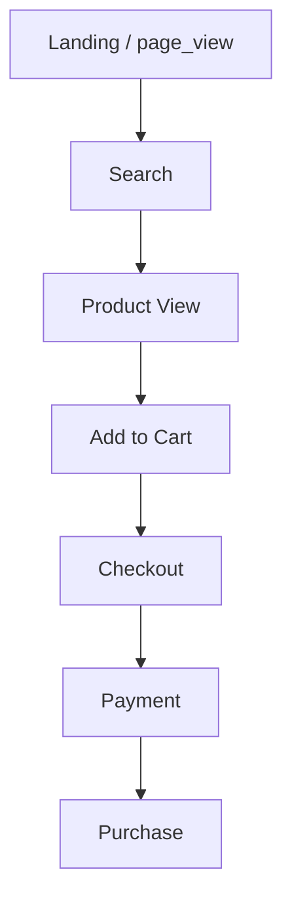

**Computation.** For each session we detect the furthest step reached, then count users/sessions at each step. Conversion rate at step *n* = users reaching step *n* ÷ users reaching step 1. Drop-off at step *n* = 1 − (users at *n* ÷ users at *n−1*).

```sql
WITH step_reached AS (
  SELECT session_id,
    MAX(CASE WHEN event_type='page_view'    THEN 1 ELSE 0 END) AS s1,
    MAX(CASE WHEN event_type='search'       THEN 1 ELSE 0 END) AS s2,
    MAX(CASE WHEN event_type='product_view' THEN 1 ELSE 0 END) AS s3,
    MAX(CASE WHEN event_type='add_to_cart'  THEN 1 ELSE 0 END) AS s4,
    MAX(CASE WHEN event_type='checkout'     THEN 1 ELSE 0 END) AS s5,
    MAX(CASE WHEN event_type='payment'      THEN 1 ELSE 0 END) AS s6,
    MAX(CASE WHEN event_type='purchase'     THEN 1 ELSE 0 END) AS s7
  FROM fact_events GROUP BY session_id
)
SELECT SUM(s1) landing, SUM(s2) search, SUM(s3) product_view,
       SUM(s4) add_to_cart, SUM(s5) checkout, SUM(s6) payment, SUM(s7) purchase
FROM step_reached;
```

**Illustrative output & insight:**

| Step | Sessions | Conversion from top | Drop-off from prev |
|---|---|---|---|
| Landing | 100,000 | 100% | — |
| Search | 72,000 | 72% | 28% |
| Product View | 61,000 | 61% | 15% |
| Add to Cart | 24,000 | 24% | 61% |
| Checkout | 18,500 | 18.5% | 23% |
| Payment | 14,200 | 14.2% | 23% |
| Purchase | 11,900 | 11.9% | 16% |

The largest drop-off is **Product View → Add to Cart (61%)**, and a secondary leak sits at **Payment**. The engine then slices these by **device, city, and category** to localize the leak, producing recommendations such as *"Payment drop-off is 2.1× higher on Android than iOS — investigate the Android payment sheet."*

### 7.2 Cohort Analysis

Cohorts group users by their acquisition period and track how many stay active over subsequent periods.

- **Monthly cohort:** users bucketed by `first_seen` month; activity measured per following month.
- **Weekly cohort:** same logic at ISO-week grain for faster-moving products.
- **Retention heatmap:** rows = cohort, columns = period offset, cell = % of cohort still active. Computed from `retention_metrics` divided by cohort size.
- **Repeat purchase:** share of a cohort with ≥2 successful orders.
- **Loyal users:** users with orders in ≥3 distinct months.
- **Churn trend:** 1 − retention over time.

**Retention rate** for cohort *c* at offset *k* = active users of *c* in period *c+k* ÷ size of cohort *c*.

**Calculation walkthrough.** Each user is stamped with a `cohort_month` (the month of `first_seen`). For every month a user makes a successful purchase, we record an `active_month`. The `month_offset` is the integer month difference between `active_month` and `cohort_month` (0 = acquisition month). Counting distinct active users per `(cohort_month, month_offset)` gives the numerator; the count of distinct users in each cohort gives the denominator. Dividing numerator by denominator yields the retention percentage that fills each heatmap cell. **Repeat purchase rate** counts users with ≥2 successful orders divided by all buyers in the cohort. **Loyal users** are those active in ≥3 distinct months. **Churn** at offset *k* is simply `1 − retention(k)`, and plotting churn over offsets gives the churn trend curve.

Illustrative monthly heatmap (% retained):

| Cohort | M0 | M1 | M2 | M3 |
|---|---|---|---|---|
| Apr 2026 | 100 | 41 | 33 | 29 |
| May 2026 | 100 | 45 | 36 | — |
| Jun 2026 | 100 | 48 | — | — |

Rising M1 retention (41→45→48) suggests onboarding improvements are working.

### 7.3 KPI Dashboard

| KPI | Formula | Business importance | Visualization | Threshold (example) |
|---|---|---|---|---|
| Revenue | Σ successful `order_amount` | Top-line health | Trend line | Alert if −10% WoW |
| Orders | count successful orders | Volume health | Bar/line | — |
| DAU | distinct users active/day | Engagement | Line | — |
| WAU | distinct users active/week | Engagement | Line | — |
| MAU | distinct users active/month | Reach | Line | — |
| Conversion Rate | purchases ÷ sessions | Funnel efficiency | Gauge | Alert < 8% |
| Bounce Rate | single-event sessions ÷ sessions | Landing quality | Gauge | Alert > 40% |
| Repeat Purchase Rate | users w/ ≥2 orders ÷ buyers | Loyalty | Gauge | Target > 30% |
| Average Order Value | revenue ÷ orders | Basket size | KPI card | — |
| Revenue Per User | revenue ÷ active users | Monetization | KPI card | — |
| Session Duration | avg(last_ts − first_ts) per session | Engagement depth | Histogram | — |
| Cart Abandonment | carts w/o purchase ÷ carts | Pre-purchase leak | Gauge | Alert > 65% |
| Checkout Success | purchases ÷ checkouts | Checkout health | Gauge | Alert < 70% |
| Payment Success | success ÷ payment attempts | Payment health | Gauge | Alert < 90% |
| Customer Lifetime Value | AOV × purchase freq × lifespan | Long-term value | KPI card | — |
| Customer Acquisition Cost | marketing spend ÷ new customers | Acquisition efficiency | KPI card | Alert if CAC > CLV/3 |

### 7.4 Root Cause Analysis

RCA does not stop at "revenue is down." It decomposes the change along dimensions until it reaches an actionable driver.

**Contribution math.** For a metric that moved by ΔM between two periods, each dimension member *m* contributes `Δ_m = M_current(m) − M_prior(m)`. Members are ranked by |Δ_m|; the member with the largest negative contribution is the one the metric change is "mostly about." The engine repeats this one level deeper inside that member (e.g. within Android, break the delta down by funnel step), and continues until the branch is specific enough to act on. This is the same logic a good analyst applies manually — InsightFlow just automates the drill path and picks the biggest-loser branch at each level.

**Worked example.** Revenue fell 18% week-over-week. Splitting the −18% delta by device shows Android contributed the largest negative share (−31% within Android vs −4% iOS). Drilling into Android by funnel step shows the payment step drop-off roughly doubled. Splitting Android payment failures by method isolates UPI. Splitting UPI failures by time and location concentrates them in the evening peak in Bangalore. The terminal node — *UPI failures, evening peak, Bangalore, Android* — maps to the recommendation template for payment-gateway degradation.

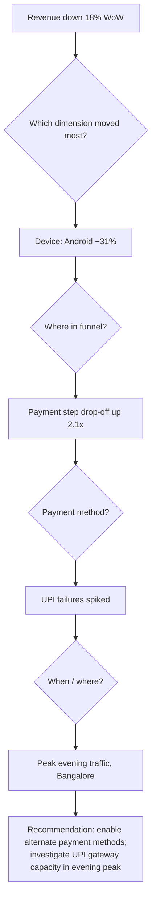

**Logic.** RCA runs a contribution analysis: for the moved metric, it computes each dimension member's contribution to the delta (member delta × weight). It follows the largest contributor down the hierarchy device → funnel step → payment method → time/location, at each level choosing the branch with the biggest negative contribution. The terminal node is paired with a rule-based recommendation template.

**Workflow.** (1) Detect the anomaly from `revenue_trend`. (2) Attribute the delta across dimensions using window functions. (3) Drill into the top contributor. (4) Stop when the driver is specific enough to act on. (5) Emit recommendation.

The **decision tree** above is the visualization; the dashboard renders it interactively, and the AI copilot narrates it in prose.

---

## 8. Phase 5 — Dashboard

Built in Streamlit, exactly four pages. Every page carries charts, KPIs, filters, drill-downs, and a business-recommendation panel.

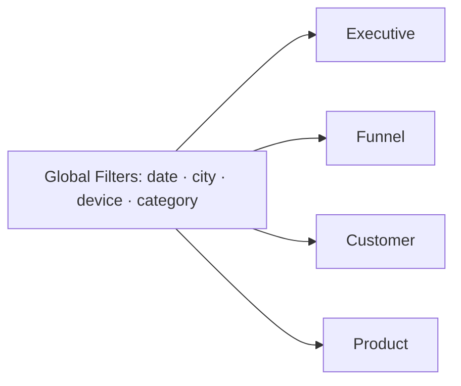

### 8.1 Executive Dashboard
Revenue, orders, growth %, conversion, and an **alerts** strip driven by KPI thresholds (§7.3). Top-KPI cards, revenue trend chart with moving average, and an auto-generated business summary sentence at the top.

### 8.2 Funnel Dashboard
The purchase funnel with per-step conversion and drop-off, drop-off **heatmaps**, and side-by-side **device** and **category** comparisons. Drill-down: click a step to see sessions lost by city/device.

### 8.3 Customer Dashboard
New vs returning split, retention heatmap, repeat-purchase rate, top cities, top customer segments, and revenue by segment. Drill-down from a cohort cell to its user list.

### 8.4 Product Dashboard
Top and worst products, category trends, revenue trends, feature adoption, and the `product_performance` leaderboard with view→buy rate. Drill-down from a category to its products.

Each page ends with a **Business Recommendations** panel that surfaces the RCA/AI output relevant to the current filters.

---

## 9. Phase 6 — AI Analytics Copilot

The copilot is **not** a chatbot. It is a constrained text-to-SQL-to-insight pipeline grounded in the warehouse.

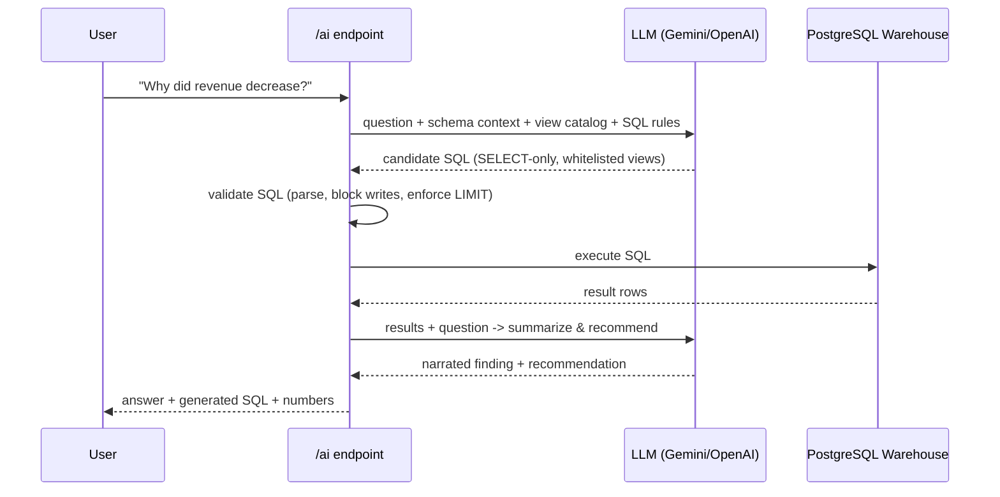

**Architecture.** A thin server layer sits between the LLM and the warehouse. The LLM never touches the database directly; it only proposes SQL, which the server validates and executes.

**Prompt flow.** (1) *Generation prompt* — question + schema + view catalog + strict rules ("SELECT only, only these views/tables, always include a date filter"). (2) *Summarization prompt* — real result rows + original question → concise finding and one recommendation.

**SQL generation guardrails.** The generated statement is parsed; anything other than a single `SELECT` is rejected. Only whitelisted views/tables are allowed. A `LIMIT` is enforced. This makes the copilot safe and auditable.

**Business insight generation.** The summarizer is instructed to lead with the number, name the top contributors, and end with exactly one recommendation.

**Example 1.** *"Why did revenue decrease?"* → *"Revenue dropped 18%. Major contributors: Android checkout failures and UPI payment issues during peak traffic. Recommendation: enable alternate payment methods during evening peak."*

**Example 2.** *"What should marketing focus on?"* → *"Delhi repeat customers convert 25% better than average. Recommendation: run a loyalty campaign targeting Delhi repeat buyers."*

**Prompt templates.**

```text
[GENERATION]
You are a SQL generator for the InsightFlow warehouse.
Rules: output ONE SELECT statement only; use only these views: {view_catalog};
always filter by date; never write/DDL; add LIMIT 500.
Schema: {schema}
Question: {question}
SQL:

[SUMMARIZATION]
Given the question "{question}" and these query results:
{result_rows}
Write: (1) one-sentence finding with the key number,
(2) the top 1-2 contributors, (3) exactly one recommendation.
```

**Limitations.** The copilot answers only what the warehouse can support; it cannot forecast beyond available data, cannot explain causation it cannot measure, and depends on view coverage. Ambiguous questions are answered against the closest matching view with the assumption stated.

---

## 10. Website Workflow

Complete user journey:

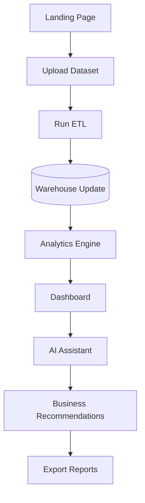

**User Flow Diagram:**

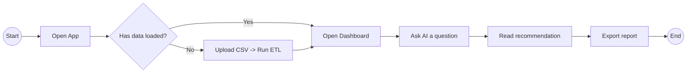

**System Flow Diagram:**

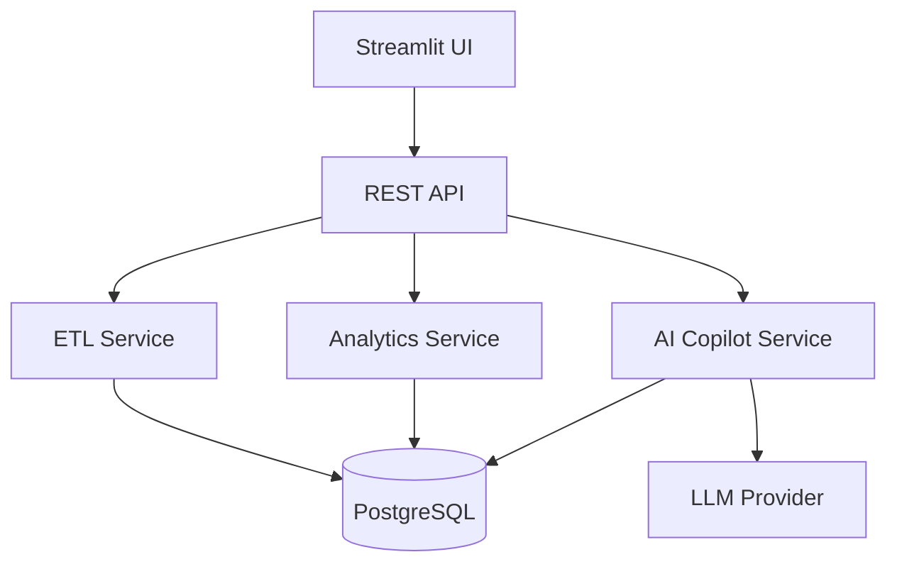

**Sequence Diagram (upload → recommendation):**

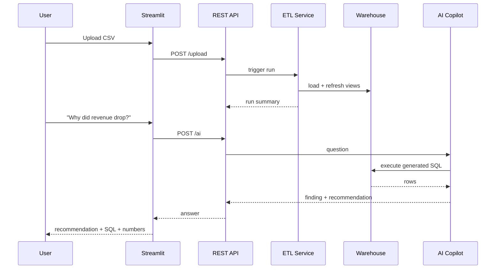

---

## 11. Project Structure

```text
InsightFlow/
├── data/
│   ├── raw/            # incoming source CSVs (immutable)
│   ├── processed/      # cleaned/validated intermediate files
│   └── warehouse/      # DB backups / exports
├── etl/                # extract, validate, clean, transform, keys, load, quality
├── sql/
│   ├── ddl/            # schema: tables, partitions, indexes
│   ├── views/          # 12 analytics views
│   └── materialized/   # materialized view definitions
├── analytics/          # funnel, cohort, kpi, rca modules (Python)
├── dashboard/          # Streamlit app: 4 pages + components
├── ai/                 # copilot: prompts, sql-guard, runner
├── config/             # settings, schema contracts, thresholds
├── utils/              # logging, db connection, helpers
├── tests/              # unit + data-quality tests
├── docs/               # this SDD/SRS and diagrams
├── requirements.txt
└── README.md
```

| Folder | Responsibility |
|---|---|
| `data/raw` | Source of truth for inputs; never mutated. |
| `data/processed` | Post-clean staging artifacts for debugging. |
| `etl/` | All pipeline stages as independent modules. |
| `sql/ddl` | Warehouse structure, partitions, indexes. |
| `sql/views` | Governed metric definitions. |
| `analytics/` | Python wrappers turning views into analyses. |
| `dashboard/` | Presentation layer (Streamlit). |
| `ai/` | Text-to-SQL copilot and guardrails. |
| `config/` | Schema contracts, KPI thresholds, env mapping. |
| `utils/` | Cross-cutting helpers (DB, logging). |
| `tests/` | Correctness + data-quality gates. |
| `docs/` | Engineering documentation. |

---

## 12. Tech Stack

| Technology | Purpose | Reason for choice |
|---|---|---|
| PostgreSQL | Warehouse + analytics engine | Mature SQL, window functions, partitioning, materialized views — everything the analytics layer needs on a single node. |
| Python | ETL, analytics, API glue | Rich data ecosystem; the lingua franca of data engineering. |
| SQL | Metric & analysis logic | Set-based, declarative, and the correct place for warehouse logic. |
| Pandas | In-memory transform/clean | Ergonomic chunked CSV processing and reshaping. |
| NumPy | Numeric operations | Fast vectorized math under Pandas. |
| Plotly | Interactive charts | Rich, interactive visuals embeddable in Streamlit. |
| Power BI | Optional executive BI | Familiar to business stakeholders for exec reporting. |
| Streamlit | Dashboard app | Fastest path from Python to a multi-page data app. |
| Gemini API | LLM for copilot | Strong reasoning/SQL generation with managed keys. |
| OpenAI API | Alternate LLM | Provider redundancy for the copilot. |
| Git | Version control | Track schema, SQL, and code changes. |
| Cron | Scheduling | Sufficient for nightly batch; no orchestration overhead. |
| VS Code | IDE | First-class Python + SQL tooling. |
| Markdown | Documentation | Portable, diffable, renders diagrams via Mermaid. |

---

## 13. Project Architecture (Diagrams)

**High-Level Architecture:**

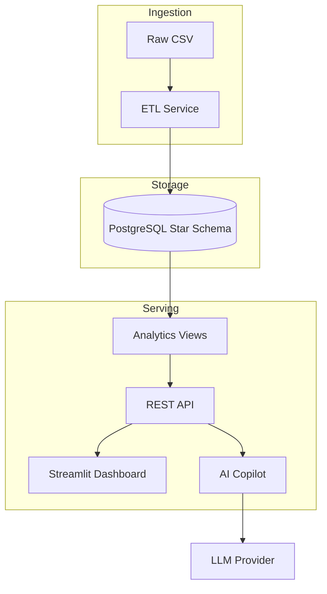

**Low-Level Architecture:**

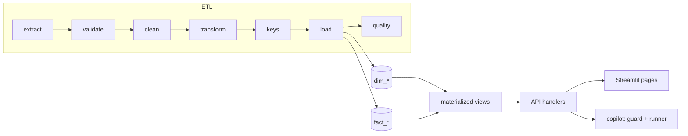

**Component Diagram:**

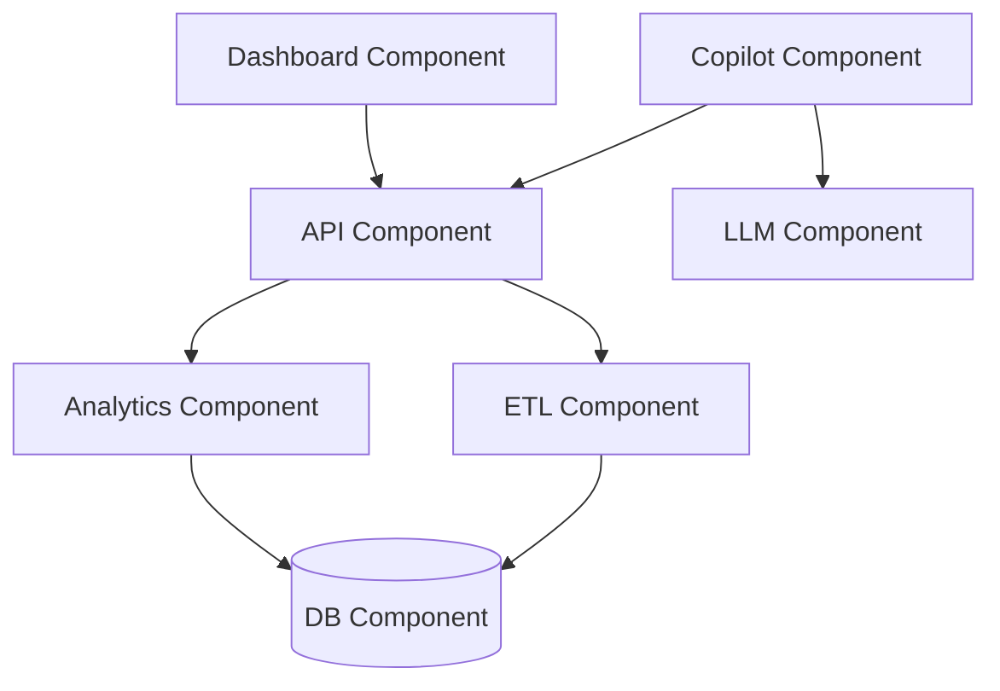

**Data Flow Diagram:**

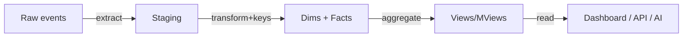

The **ETL Flow**, **Warehouse Flow**, **Dashboard Flow**, **AI Workflow**, and **Website Workflow** diagrams are given in §5.1, §4.2, §8, §9, and §10 respectively.

---

## 14. API Design

Base path `/api/v1`. JSON in/out. All list endpoints accept `date_from`, `date_to`, and optional `city`, `device`, `category` filters.

| Endpoint | Method | Request | Response | Description |
|---|---|---|---|---|
| `/upload` | POST | multipart CSV | `{run_id?, file_id, status}` | Upload a raw event file. |
| `/etl` | POST | `{file_id, mode:"incremental"|"full"}` | `{run_id, rows_loaded, status}` | Trigger an ETL run. |
| `/dashboard` | GET | filters | `{kpis, trends, alerts}` | Executive summary payload. |
| `/funnel` | GET | filters + `split_by` | `{steps[], conversion[], dropoff[]}` | Funnel with drop-offs. |
| `/cohort` | GET | `grain:"month"|"week"` | `{cohorts[][], sizes[]}` | Retention heatmap data. |
| `/kpi` | GET | `metric?, filters` | `{name, value, threshold, status}[]` | KPI values + threshold status. |
| `/root-cause` | POST | `{metric, period}` | `{tree, drivers[], recommendation}` | RCA decomposition. |
| `/ai` | POST | `{question}` | `{answer, sql, rows, recommendation}` | Copilot Q&A. |
| `/reports` | POST | `{page, filters, format:"pdf"|"csv"}` | file stream | Export a report. |

Example `/ai` response:

```json
{
  "answer": "Revenue dropped 18% week-over-week.",
  "recommendation": "Enable alternate payment methods during evening peak.",
  "sql": "SELECT ... FROM revenue_trend WHERE ...",
  "rows": [{"dod_growth_pct": -18.0, "device": "Android"}]
}
```

---

## 15. Security

- **Input validation:** every API payload validated against a schema; uploads checked for size, MIME, and column contract before processing.
- **SQL injection prevention:** all warehouse access uses parameterized queries / bound parameters; the AI copilot additionally parses generated SQL and rejects anything but a whitelisted single `SELECT`.
- **Secrets management:** DB credentials and LLM keys injected via environment variables; never committed. A `.env` is git-ignored; production uses the host secret store.
- **API key management:** LLM keys held server-side only; the browser never sees them. Keys are rotatable via config without code changes.
- **Error handling:** errors are caught, logged with a correlation id, and returned to clients as sanitized messages (no stack traces or SQL leaked).
- **Logging:** structured logs with run/correlation ids; no PII or secrets in logs; log level configurable per environment.

**Threat model summary.** The three highest-risk surfaces are the upload endpoint (malformed or malicious files), the AI copilot (prompt-driven SQL), and secret handling. Uploads are contained by the schema contract and MIME/size checks before any parsing, so a hostile file fails fast at the boundary. The copilot is contained by SELECT-only parsing against a whitelist of views, so even a jailbroken prompt cannot mutate or exfiltrate beyond the governed analytical surface. Secrets never reach the client and are rotatable without redeploying code. Together these keep the blast radius of any single failure small and auditable.

---

## 16. Future Enhancements

| Enhancement | Value |
|---|---|
| Real-time analytics | Sub-minute freshness for live monitoring. |
| Streaming ingestion | Event-time processing as data arrives. |
| Airflow | DAG orchestration, retries, backfills beyond Cron. |
| Kafka | Durable event bus for streaming. |
| Forecasting | Predict revenue/retention, not just explain the past. |
| Recommendation engine | Product recommendations from behavior. |
| Anomaly detection | Auto-flag metric anomalies before an analyst asks. |
| Role-based access | Multi-user permissions and row-level security. |
| Cloud deployment | Managed Postgres + containerized services for scale. |

---

## 17. Resume Section

**Professional project description.**
Built InsightFlow, an end-to-end product analytics platform that ingests event-level eCommerce data into a partitioned PostgreSQL star-schema warehouse via an idempotent Python ETL pipeline, exposes a governed advanced-SQL analytics layer (funnel, cohort, KPI, root-cause), and surfaces findings through a four-page Streamlit dashboard and an LLM copilot that generates, validates, and executes warehouse SQL to produce auditable business recommendations.

**ATS-optimized resume bullets.**
- Designed and implemented a partitioned PostgreSQL **star-schema data warehouse** (2 fact, 6 dimension tables) fed by an **idempotent Python/Pandas ETL** with schema validation, deduplication, surrogate keys, incremental loading, and data-quality gates.
- Built an **advanced SQL analytics layer** (12 views + materialized views) using window functions (LAG/LEAD, RANK, moving averages) powering **funnel, cohort/retention, KPI, and root-cause** analysis that localized an 18% revenue drop to a specific device/payment/geo driver.
- Developed an **AI analytics copilot** (Gemini/OpenAI) with a guarded **text-to-SQL** pipeline that executes validated read-only queries and returns **actionable recommendations**, plus a four-page **Streamlit** dashboard and a REST API.

**GitHub README summary.**
InsightFlow is an end-to-end product analytics platform: raw event CSV → Python ETL → PostgreSQL star-schema warehouse → advanced SQL analytics (funnel/cohort/KPI/RCA) → Streamlit dashboard + AI copilot that answers business questions with real, query-backed recommendations. Cron-scheduled batch, single-node, no heavy infra.

**Elevator pitch.**
"Most analytics projects show you charts. InsightFlow tells you *why* revenue moved and *what to do about it* — it decomposes a metric change down to the exact device, payment method, and city driving it, and an AI copilot writes the SQL, runs it, and hands you a recommendation you can act on."

---

## 18. Interview Preparation

**SQL (1–8)**
1. Why use window functions instead of self-joins for running totals?
2. Difference between `RANK`, `DENSE_RANK`, and `ROW_NUMBER`?
3. How would you compute a 7-day moving average in SQL?
4. When is a recursive CTE the right tool?
5. `COALESCE` vs `NULLIF` — when do you use each?
6. How does `FILTER` improve conditional aggregation?
7. Explain a `LEFT JOIN` producing nulls and how you'd zero-fill them.
8. How do you find the first event per session in SQL?

**Warehouse (9–16)**
9. Star vs snowflake — when and why choose each?
10. What is a conformed dimension and why does it matter here?
11. Why surrogate keys over natural keys?
12. What is fact-table grain and why define it explicitly?
13. How does range partitioning by date help query performance?
14. Explain slowly changing dimensions (Type 1 vs 2).
15. When would you materialize a view vs keep it virtual?
16. How do indexes interact with partitioned tables?

**Python (17–24)**
17. How do you process a CSV too large for memory?
18. How do you make an ETL run idempotent?
19. How do you generate surrogate keys reliably across runs?
20. How do you structure logging for a batch pipeline?
21. How do you validate a schema contract before loading?
22. How do you handle a transaction rollback on a quality-gate failure?
23. Pandas vs pure SQL — where do you draw the line?
24. How do you test data-quality rules?

**Product Analytics (25–32)**
25. How do you define a funnel step from raw events?
26. Conversion rate vs drop-off rate — define both.
27. How do you localize where users drop in a funnel?
28. Monthly vs weekly cohorts — when each?
29. How do you compute retention at offset k?
30. What distinguishes a loyal user from a repeat buyer?
31. How do you compare device performance fairly?
32. Why slice a single metric by multiple dimensions?

**KPI (33–38)**
33. Define AOV, RPU, and CLV and how they differ.
34. How is CAC computed and when is it healthy vs CLV?
35. What does a high cart-abandonment rate imply?
36. Difference between checkout success and payment success?
37. How would you set a threshold/alert for conversion rate?
38. DAU/WAU/MAU — what does the ratio tell you?

**Business (39–43)**
39. Revenue dropped 18% — walk me through your investigation.
40. Which city "converts best" — how do you define best?
41. How do you turn an analysis into a recommendation?
42. How do you know a recommendation worked?
43. How do you prioritize which funnel leak to fix first?

**AI (44–47)**
44. How do you stop an LLM from hallucinating numbers?
45. How do you guard generated SQL from being destructive?
46. Describe the text-to-SQL-to-insight prompt flow.
47. What are the limitations of the copilot?

**System Design (48–50)**
48. Design the ETL to be re-runnable without duplicates.
49. Where would you add caching/materialization for scale?
50. How would you evolve this from batch to streaming?

---

## 19. Learning Outcomes

| Area | What you will be able to do |
|---|---|
| SQL | Write window functions, CTEs, and optimized analytical queries. |
| Python | Build a modular, testable, idempotent ETL. |
| Analytics | Turn raw events into funnels, cohorts, and KPIs. |
| Warehouse | Design and justify a partitioned star schema. |
| ETL | Implement validation, dedup, incremental load, quality gates. |
| Dashboarding | Build multi-page, filterable, drill-down dashboards. |
| Product Analytics | Answer "why" and "where," not just "what." |
| Business Intelligence | Set KPIs, thresholds, and alerts that matter. |
| AI Integration | Ground an LLM in a warehouse via guarded text-to-SQL. |
| Communication | Convert numbers into recommendations. |
| Problem Solving | Decompose a metric change to its root driver. |

---

## 20. Development Roadmap

| Week | Deliverable | Milestone | Expected output |
|---|---|---|---|
| 1 | Warehouse DDL + star schema | Schema review passed | Tables, partitions, indexes created |
| 2 | ETL extract/clean/validate | First clean batch loaded | Staging populated, run log written |
| 3 | Surrogate keys + incremental load + quality gates | Idempotent load proven | Re-run produces no dupes |
| 4 | Analytics views (all 12) + materialized | Views reviewed | Metrics reproducible in SQL |
| 5 | Funnel + cohort + KPI modules | Analytics engine demo | Funnel/cohort/KPI outputs |
| 6 | Root-cause analysis | RCA localizes a seeded drop | Decision-tree output |
| 7 | Streamlit dashboard (4 pages) + REST API | Dashboard usable end-to-end | Filterable, drill-down UI |
| 8 | AI copilot + reports + docs | Full platform demo | Guarded copilot + exports |

---

## 21. What Not To Build

The following are **explicitly excluded** from this project and appear only as future enhancements (§16). Cron scheduling and single-node PostgreSQL fully satisfy this batch workload; adding these now would be unjustified complexity.

| Excluded | Why not now |
|---|---|
| Airflow | Cron scheduling is sufficient for nightly batch. |
| Kafka | No streaming requirement. |
| Spark | Data fits comfortably on a single Postgres node. |
| Hadoop | No distributed storage need. |
| Docker Swarm | No cluster orchestration need. |
| Kubernetes | Single-node deployment; over-engineering. |
| Snowflake | Self-managed Postgres meets requirements. |
| Azure Synapse | No cloud-DW requirement at this scale. |

---

## 22. Appendix

### 22.1 Environment Variables

| Variable | Purpose |
|---|---|
| `PG_DSN` | PostgreSQL connection string |
| `LLM_PROVIDER` | `gemini` or `openai` |
| `LLM_API_KEY` | LLM key (server-side only) |
| `ETL_WATCH_DIR` | Directory watched for new CSVs |
| `LOG_LEVEL` | Logging verbosity |

### 22.2 Cron Entry

```cron
# Nightly incremental ETL at 02:00
0 2 * * * cd /opt/insightflow && /usr/bin/python -m etl.pipeline --mode incremental >> logs/cron.log 2>&1
```

### 22.3 Data-Quality Test Example

```python
def test_no_null_fact_keys(conn):
    row = conn.execute(
        "SELECT COUNT(*) FROM fact_events "
        "WHERE date_key IS NULL OR user_key IS NULL OR device_key IS NULL"
    ).fetchone()
    assert row[0] == 0, "fact_events has null dimension keys"
```

*End of document.*
